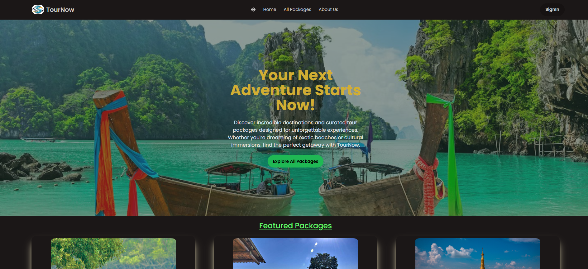

# Tour Now — Tour Package Booking Management

**Live Demo:** [https://tour-now-client.web.app/](https://tour-now-client.web.app/)

---

## 📌 Project Overview

**Tour Now** is a full-stack Tour Package Booking platform built with the **MERN** stack and Firebase Authentication. Users can browse public tour packages, view detailed itineraries, and make bookings. Authenticated guides can add, update, and manage their own tour packages. Bookings are stored in MongoDB and each booking increments the package's booking count.

This project was built to satisfy the Assignment-11 (assignment\_category\_17) requirements and is designed to be responsive, secure, and recruiter-friendly.

---

## 🖼 Screenshot



---

## 🧰 Main Technologies

* **Frontend:** React 19, Vite
* **Styling:** Tailwind CSS, DaisyUI
* **Backend:** Node.js, Express
* **Database:** MongoDB (Atlas)
* **Authentication:** Firebase Auth (Email/Password & Google)
* **Auth (server):** JWT for protecting private APIs
* **Other:** Framer Motion, Swiper, SweetAlert2, React Toastify, Lottie

---

## ✨ Core Features

* Public browsing of tour packages (data fetched from MongoDB)
* Authentication with Firebase (email/password + Google)
* Authenticated users can **book** packages
* Authenticated guides can **Add**, **Update**, **Delete** their own packages
* **My Bookings** page for users — view and confirm bookings (status updates)
* Package Details page (private) with full itinerary and booking modal
* Booking count incremented atomically when a booking is made (using `$inc`)
* Server-side JWT-protected private routes
* Responsive layout for mobile, tablet & desktop
* Toast notifications, confirmation modals, and micro-animations

---

## 📦 Dependencies (selected)

> These are from the client `package.json` you used.

**Dependencies**

* @tailwindcss/vite
* daisyui
* dotenv
* firebase
* framer-motion
* lottie-react
* motion
* react
* react-dom
* react-icons
* react-router
* react-toastify
* sweetalert2
* swiper
* tailwindcss

**DevDependencies**

* @eslint/js
* @types/react
* @types/react-dom
* @vitejs/plugin-react
* eslint
* eslint-plugin-react-hooks
* eslint-plugin-react-refresh
* globals
* vite

**(Typical server dependencies you’ll need)**

* express
* cors
* mongoose (or mongodb native driver)
* dotenv
* jsonwebtoken
* bcrypt (optional for server-side password handling)
* firebase-admin (for verifying Firebase tokens / admin tasks)
* nodemon (dev)


---

## ⚙️ Environment Variables

Create a `.env` file in both the `client` and `server` directories. Example values shown below.

**Client (`client/.env`) — Vite expects `VITE_` prefix**

```env
VITE_API_URL=https://your-api-url.com
VITE_FIREBASE_API_KEY=your_firebase_api_key
VITE_FIREBASE_AUTH_DOMAIN=your_project.firebaseapp.com
VITE_FIREBASE_PROJECT_ID=your_project_id
VITE_FIREBASE_STORAGE_BUCKET=your_project.appspot.com
VITE_FIREBASE_MESSAGING_SENDER_ID=your_messaging_sender_id
VITE_FIREBASE_APP_ID=your_app_id
VITE_FIREBASE_MEASUREMENT_ID=your_measurement_id
```

**Server (`server/.env`)**

```env
PORT=5000
MONGODB_URI=your_mongodb_atlas_connection_string
JWT_SECRET=some-long-secret-string
FIREBASE_SERVICE_ACCOUNT_PATH=./serviceAccountKey.json  # or JSON string
CORS_ORIGIN=https://tour-now-client.web.app
```

> ⚠️ Add your deployed client domain (e.g., `https://tour-now-client.web.app`) to Firebase console **Authorized domains**.

---

## 🚀 Run Locally — Step-by-step

**1. Clone the repos**

```bash
# Client
git clone <client-repo-url> client
# Server
git clone <server-repo-url> server
```

**2. Setup the server**

```bash
cd server
cp .env.example .env   # or create .env manually and fill values
npm install
# Start server (production)
npm run start
# Start server (dev with nodemon)
npm run dev
```

**3. Setup the client**

```bash
cd ../client
cp .env.example .env   # or create .env manually and fill values
npm install
npm run dev
# or build for production
npm run build
```

Open the client at `http://localhost:5173` (or the URL shown by Vite). The client will call the server API using `VITE_API_URL`.

---

## 📌 Deployment Tips

* **Server:** Deploy to Render / Railway / Heroku / Vercel (Serverless) / DigitalOcean. Ensure `MONGODB_URI` and `JWT_SECRET` are configured in environment settings.
* **Client:** Deploy to Vercel / Netlify / Firebase Hosting. Add the deployed client domain to Firebase **Authorized domains**.
* Use `npm run build` on the client and point the client’s `VITE_API_URL` to your server’s production URL.


---

## 🔍 Notes & Known Deviations

* I used **regular controlled forms** (React form state) instead of `react-hook-form`. This is intentional and valid for the assignment.
* If you want `react-hook-form` integrated later I can convert forms quickly.

---

## 📂 Useful Links

* **Live site (client):** [https://tour-now-client.web.app/](https://tour-now-client.web.app/)


---

## ✉️ Author

**Linkon Juwel Tripura** — Frontend / Fullstack Developer

